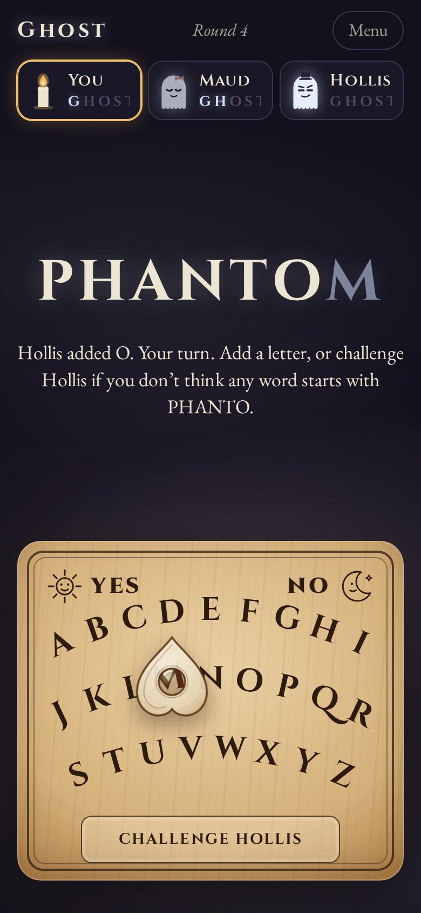
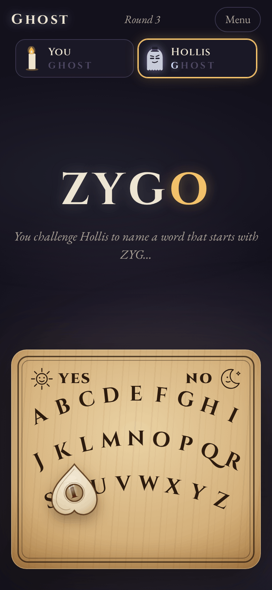
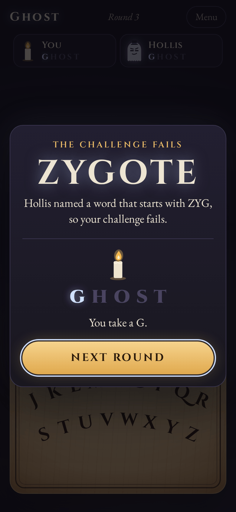
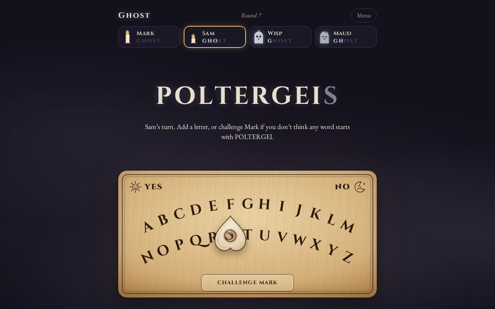

# Ghost

**Play it: [junkdrawer.works/ghost](https://junkdrawer.works/ghost/)**

**The old spelling game, played on a spirit board.** Players take turns adding a letter to a word in progress. Finish a real word and you lose the round. Lose five rounds and you've spelled GHOST, and you're out. Play against three ghosts of different strengths, or pass the phone around a table of friends.

<p align="center">
  
  &nbsp;
  
  &nbsp;
  
</p>

<p align="center">
  
</p>

## How it plays

- **Slide the planchette.** Press anywhere on the board and the nearest letter lights up under the planchette's window. Slide to change your mind, and let go to play it. On a computer you can also type.
- **Don't finish a word.** A real word of four letters or more ends the round, and whoever spelled it takes the next letter of GHOST. CAT doesn't count; CATS does.
- **Challenge** when you don't believe any word starts with the letters so far. Tap the plaque at the bottom of the board, or NO. The player before you has to spell the rest of a word on the board and tap YES. If they can, you lose the round. If they can't, they do. Bluffing is part of the game.
- **The loser starts the next round.** Spell GHOST and you're out. People burn down like candles; ghosts fade. The last one left wins.
- **Three ghosts.** Wisp (easy) knows everyday words and plays loosely. Maud (medium) knows most words and usually thinks a move ahead. Hollis (hard) knows every word in the list and plays to win. When cornered, Hollis heads for a word you've probably never heard of, and backs it up if you challenge.
- **How they think.** For every letter it could add, a ghost works out who would end up stuck finishing a word if everyone played sensibly from there, and picks a letter that leaves someone else stuck. The ghosts differ in how many words they know and how often they bother to think it through. They bluff when they're cornered, and challenge when they can't think of a word that fits.
- **Pass and play.** Add everyone's names, with or without ghosts, up to six at the table. When you play alone, it keeps your record against each ghost.
- **The words.** Only everyday words end a round: about 19,000 of them, counting only the ones you can actually reach. PLAYER never comes up, because the round ends at PLAY. When you name a word after a challenge, anything in a list of about 180,000 counts, and if it doesn't know a word you're sure of, you can count it anyway. Words on a public list of rude words and slurs are left out, and the ghosts never aim for or say anything that starts with one.
- No account and no server. The game in progress and your record stay in your browser. It works offline and installs to a phone's home screen.

## Running it

It's a static site: plain HTML, CSS and JavaScript modules, with no build step.

```sh
npx serve .                   # or any static file server, then open the printed address
npm install                   # only for the tools below: esbuild and upng-js
npm test                      # the rules, the dictionary and the ghosts (Node 20+), then the real page in Chromium (needs Playwright)
node tools/screenshots.mjs    # redraws docs/*.png and og.png
node tools/make-icons.mjs     # redraws the PNG icons from icon.svg
node tools/build-words.mjs    # rebuilds the word lists from their sources (downloads them the first time)
npm run build                 # dist/ghost.html, the whole game in one file
```

Opening `index.html` straight from disk won't work, because browsers block JavaScript modules on `file://`. The built file does work that way.

To put it online with GitHub Pages: **Settings → Pages → Build and deployment → Deploy from a branch**, then pick `main` and `/ (root)`.

### Files

- `js/rules.js`: the rules, as plain functions from one game state to the next.
- `js/ghosts.js`: the three ghosts and how they choose a letter, when they challenge, and the word they name when challenged.
- `js/dict.js`: the dictionary: a tree of the words that end a round, and the big list for challenges, loaded after the page is up.
- `js/words-ends.js`, `js/words-more.js`: the word lists, front-coded to keep them small (`js/packed.js`). Made by `tools/build-words.mjs` from [SCOWL](http://wordlist.aspell.net/) (Kevin Atkinson, MIT-style licence), [12dicts](http://wordlist.aspell.net/12dicts/) (Alan Beale, public domain) and ENABLE (public domain), with the [List of Dirty, Naughty, Obscene and Otherwise Bad Words](https://github.com/LDNOOBW/List-of-Dirty-Naughty-Obscene-and-Otherwise-Bad-Words) (CC BY 4.0) used as a filter.
- `js/board.js`: the spirit board, the planchette and how it follows your finger.
- `js/art.js`: the ghosts, the candles, the planchette, the sun and moon, all drawn as SVG.
- `js/app.js`: the page: choosing who plays, turns, the ghosts' moves, the end of each round, and saving.
- `fonts/`: Cinzel and EB Garamond (SIL Open Font License), served from here so nothing loads from elsewhere.
- `sw.js`: keeps a copy for playing offline. `npm test` checks that it lists every file the page needs.
- `tools/`: the screenshot, icon and word-list scripts above. `scripts/build.mjs`: the single-file build.

The game is on `window.ghostGame` if you want to poke at it from the console:

```js
ghostGame.state()                    // the game in progress
ghostGame.dict.exampleWord('zyg')    // 'zygote'
ghostGame.dict.isWord('qoph')        // true
```
